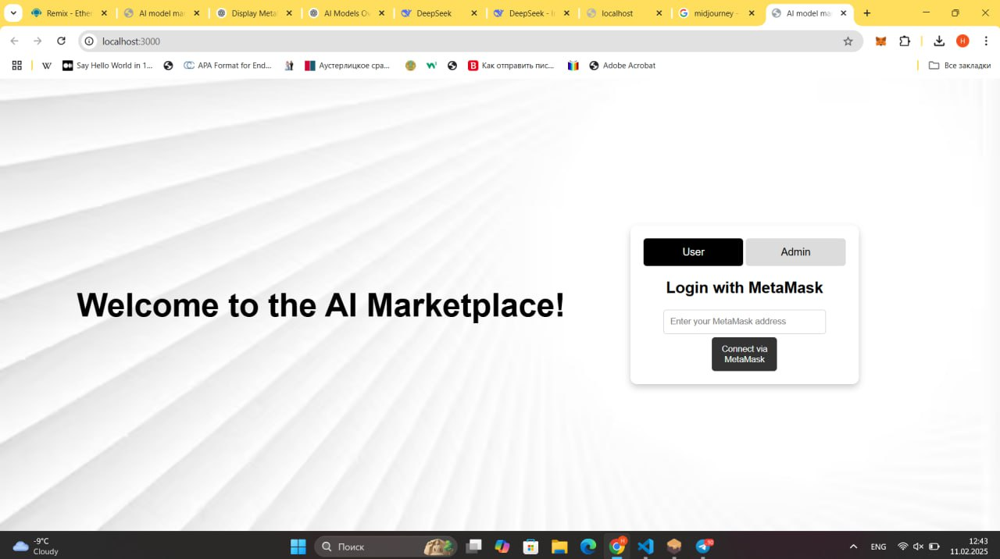
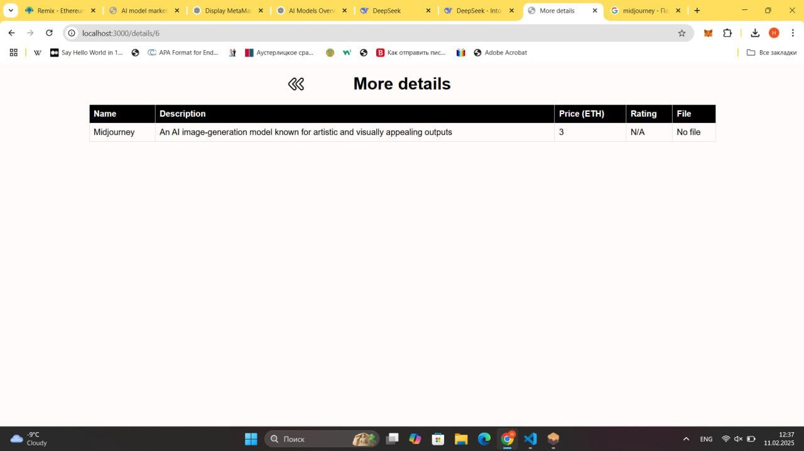

# AIModelMarketplace_ERC20Token
### Team members: 
- Nurgul Bassanova SE-2323
- Amir Kairov SE-2331
- Ulzhan Tamyzgazina SE-2325

## Contents
1. [Overview](#overview)
2. [Usage](#usage)
3. [Marketplace Website](#marketplace-website)
6. [Conclusion](#conclusion)
7. [Files](#files)
8. [License](#license)
9. [References](#references)

## Overview
This project is a decentralized marketplace where users can buy and sell AI models using an ERC-20 token. It integrates smart contracts, wallet authentication, and a seamless purchase flow. 

## **Usage**

### **1. Connect Wallet**
- Click the **"Connect Wallet"** button to link your **Metamask** account.

### **2. Check Token Balance**
- Your **ERC-20 token balance** is displayed on the UI.  
- Click **"Refresh Balance"** to update it.

### **3. List AI Models**
Sellers can create new AI model listings by providing:
- **Model Name**
- **Description**
- **Price (in ERC-20 tokens)**
- **Upload Model File** (stored securely on **IPFS/Arweave**)

### **4. Buy AI Models**
- Browse available AI models.
- Click **"Buy"** to initiate a transaction.
- The specified **ERC-20 token amount** is transferred to the seller.
- The marketplace updates automatically after a successful purchase.

## Marketplace Website

Here you can see the Welcome page for our Marketplace, where you can login with your Metamask account as an user and also as an admin. When it's successfully connected you will see the dialog page which will redirect you to your marketplace.

In More Details page you can see the more detailed information (name, description, price,rating, file) about your AI Models.
## License
MIT License

Copyright (c) 2025 UN

Permission is hereby granted, free of charge, to any person obtaining a copy
of this software and associated documentation files (the "Software"), to deal
in the Software without restriction, including without limitation the rights
to use, copy, modify, merge, publish, distribute, sublicense, and/or sell
copies of the Software, and to permit persons to whom the Software is
furnished to do so, subject to the following conditions:

The above copyright notice and this permission notice shall be included in all
copies or substantial portions of the Software.

THE SOFTWARE IS PROVIDED "AS IS", WITHOUT WARRANTY OF ANY KIND, EXPRESS OR
IMPLIED, INCLUDING BUT NOT LIMITED TO THE WARRANTIES OF MERCHANTABILITY,
FITNESS FOR A PARTICULAR PURPOSE AND NONINFRINGEMENT. IN NO EVENT SHALL THE
AUTHORS OR COPYRIGHT HOLDERS BE LIABLE FOR ANY CLAIM, DAMAGES OR OTHER
LIABILITY, WHETHER IN AN ACTION OF CONTRACT, TORT OR OTHERWISE, ARISING FROM,
OUT OF OR IN CONNECTION WITH THE SOFTWARE OR THE USE OR OTHER DEALINGS IN THE
SOFTWARE.

## References
- Kacharla, B. (n.d.). Using Ganache with Remix and Metamask. Medium. Retrieved from https://medium.com/@kacharlabhargav21/using-ganachewith-remix-and-metamask-446fe5748ccf
- Truffle Suite. (n.d.). Ganache blockchain. Retrieved from https://trufflesuite.com/ganache/
- Web3.js. (n.d.). Deploying and interacting with smart contracts. Retrieved from https://docs.web3js.org/guides/smart_contracts/smart_contracts_guide
- Web3.js. (n.d.). Documentation to Web3.js. Retrieved from https://docs.web3js.org/
- https://www.youtube.com/watch?v=-5j6Ho0Bkfk
- https://www.youtube.com/watch?v=o9Ux3xDrkIo
- https://hardhat.org/tutorial
- https://hardhat.org/tutorial/testing-contracts

